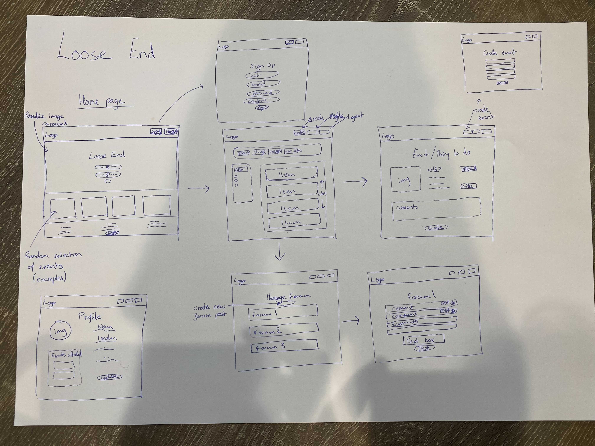
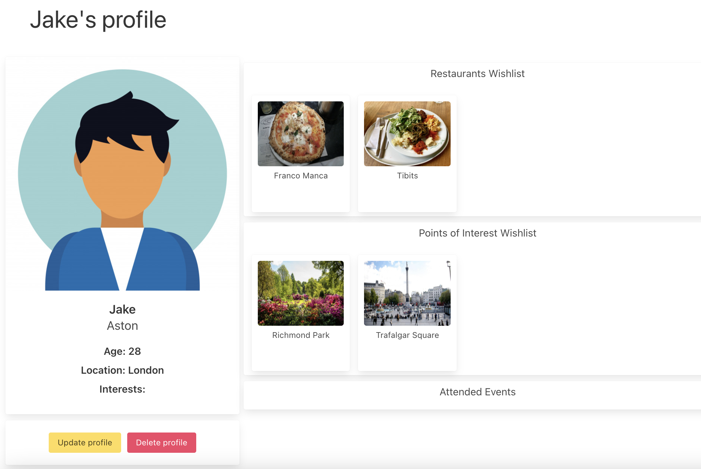
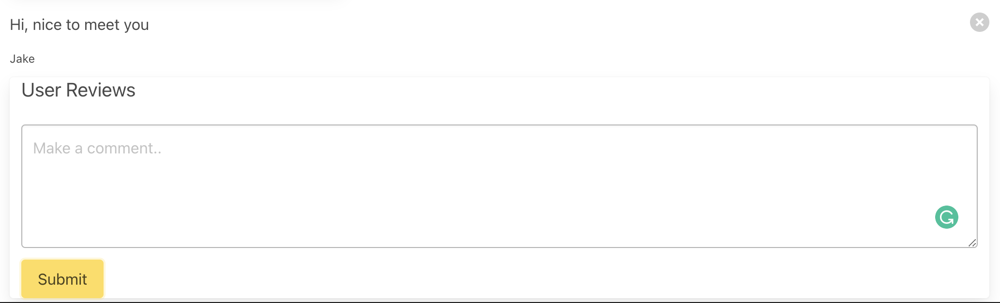
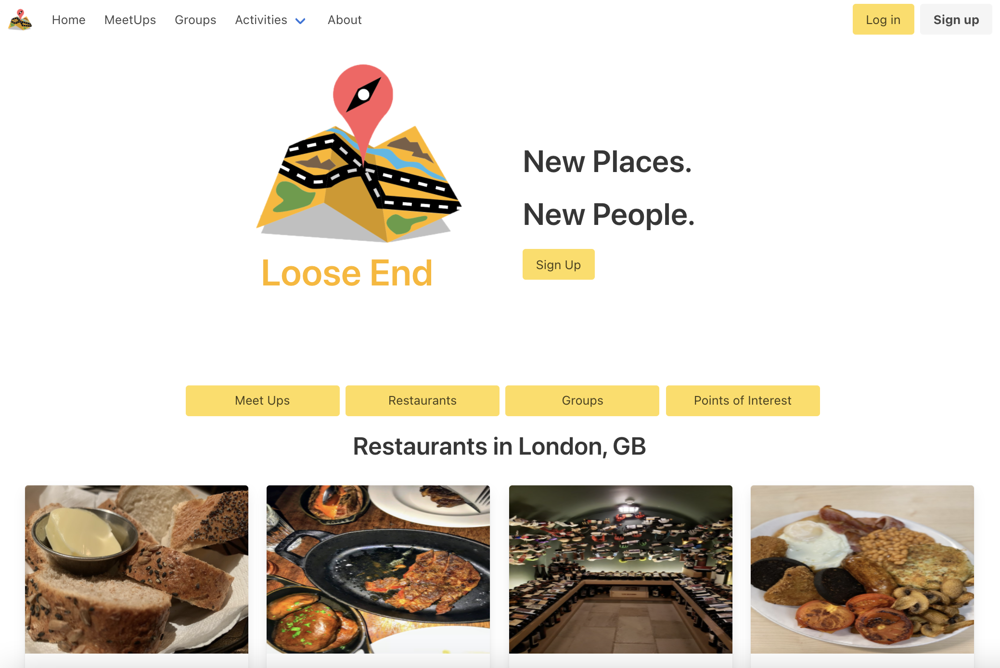
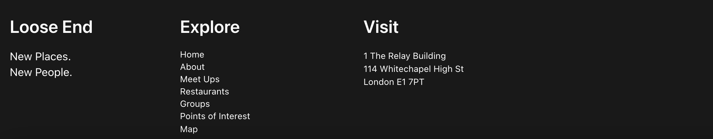

###  General Assembly, Software Engineering Immersive
# Loose End

## Overview

Project 3 was my first experience of building a full stack application as part of a group (4 people). After a short discussion we came up with the idea of building Loose End, a social app for users to add, share and review meet ups and points of interest, restaurants, as well as organise groups with associated activities

Chheck out the final project [here](https://ja-loose-end.herokuapp.com/)

## The Brief

* **Build a full-stack application** by making your own back-end and your own front-end
* **Use an Express API** to serve your data from a Mongo database
* **Consume your API with a separate front-end** built with React
* **Be a complete product** which most likely means multiple relationships and CRUD functionality for at least a couple of models
* **Implement thoughtful user stories/wireframes** that are significant enough to help you know which features are core MVP and which you can cut
* **Be deployed online** so it's publicly accessible.

--- 
## Technologies Used

### Back-end:
- Node.js
- Mongodb
- Express.js
- Bcrypt
- Mongoose
- jsonwebtoken

### Frontend:
- React
- Axios
- Bulma
- SCSS
- Http-proxy-middleware
- Nodemon
- React Router Dom
- React Mapbox GL
- React Calendar
- React select

### Development tools:
- VS code
- NPM 
- Insomnia
- Git
- Github
- Google Chrome dev tools
- Heroku (deployment)

## Approach taken

## Day 1 - Planning

The idea for our app came from a teammate who used to work in conference services and notied that those who travelled for business were often alone and didn't know what to do outside of work. We took that idea and hit the ground running.

Over Zoom and Slack, we brainstormed and strategized and whiteboarded proposals about how we thought the page could look. We sketched out our models (user, meet up, restaurants, point of interest), our routes and then we created a wireframe:



By Day 2, we were ready to begin the backend. We thought it was very important that we work as a group, so we used VS Code LiveShare to set up the backend together: creating models, controllers, routes, middleware. Once we finished the backend, we each started working on our respective front-end tasks. To ease styling, we decided to use the Bulma CSS framework.

## Back-end - Day 2 & 3

For the backend we used MongoBD and Mongoose.js to construct the MVC (Models, Views, Controllers) framework. Through the use of VS Liveshare we could work through the bulk of the backend together then breakup into the individual tasks of creating the endpoints of the particual models we were going to be taking lead on.

I took lead on the User and Comment sections of the MVC framework.

```js
const userSchema = new mongoose.Schema({
  firstName: { type: String, required: true },
  lastName: { type: String, required: true },
  email: { type: String, required: true, unique: true },
  password: { type: String, required: true },
  image: { type: String },
  age: { type: Number },
  admin: { type: Boolean },
  homeTown: { type: String },
  eventsAttended: [{ type: mongoose.Schema.ObjectId, ref: 'MeetUp' }],
  eventsCreated: [{ type: mongoose.Schema.ObjectId, ref: 'MeetUp'  }],
  upcomingEvents: [{ type: mongoose.Schema.ObjectId, ref: 'MeetUp' }],
  interests: { type: [String ] },
  restaurantWishlist: [{ type: mongoose.Schema.ObjectId, ref: 'Restaurant' }],
  poiWishlist: [{ type: mongoose.Schema.ObjectId, ref: 'Poi' }],
  groups: [{ type: mongoose.Schema.ObjectId, ref: 'Group' }],
  userReviews: [ CommentSchema ],
  inbox: [ CommentSchema ]
})

userSchema
  .pre('save', function hashPassword(next) {
    if (this.isModified('password')) {
      this.password = bcrypt.hashSync(this.password, bcrypt.genSaltSync())
    }
    next()
  })
userSchema.methods.validatePassword = function validatePassword(password) {
  return bcrypt.compareSync(password, this.password)
}

userSchema.plugin(uniqueValidator)
userSchema.plugin(mongooseHidden({ defaultHidden: { password: true, email: true } }))

export default mongoose.model('User', userSchema)
```
As we had quite ambitious ideas for what we wanted to create we decided to add more data points into our models than we might end up using in our allotted time allocation for the porject (an example of this is the inbox and messaging system).

In order to build relationships between out models we used nested schemas that would populate the data from one model into another.

In order to seed our databased with data we decided that we would create some of our own data for the user, points of interest, groups, and meet-ups. However for the restaurant data we wanted to use an external API, for this we chose to use the Yelp API.

```js
for (let i = 1; i <= drinkArray.length - 1; i++) {
      const timeout = (2000 * i) + 2000

      console.log(drinkArray[i])

      promises.push(new Promise((resolve) => {

        setTimeout(() => {
          axios.get(`https://api.yelp.com/v3/businesses/search?term=drinks,${drinkArray[i]}&location=london&locale=en_GB&sort_by=rating&limit=50&offset=${offset}`,
            { headers: { Authorization: `Bearer ${process.env.APIKEY}` } })
            .then(({ data }) => {

              const restaurant = {
                name: data.businesses[0].name,
                category: data.businesses[0].categories.map(catObj => catObj.title),
                image: data.businesses[0].image_url,
                link: data.businesses[0].url,
                price: data.businesses[0].price,
                lat: data.businesses[0].coordinates.latitude,
                long: data.businesses[0].coordinates.longitude,
                location: data.businesses[0].location.city,
                address: data.businesses[0].location.display_address,
                phone: data.businesses[0].phone,
                creator: users[0]
              }
              resolve(restaurant)
            })
        }, timeout)

      }))

    }
```

## Frontend - Day 4, 5, 6, 7

By taking the lead on the User and Comments on the backend, I decided that I wanted to take the lead for the user profile and commenting functionality on the frontend.

#### Profile



For the user profile we wanted a user to be able to edit their information (add a profile picture, change their name and location, and update their personal interests. We allowed the user to do this by checking if they had a valid JWT token. 

```js
export function getLoggedInUserId() {
  if (!localStorage) return false
  const token = localStorage.getItem('token')
  if (!token) return false
  const payloadAsString = atob(token.split('.')[1])
  const payloadAsObject = JSON.parse(payloadAsString)
  return payloadAsObject.userId
}

export function isCreator(userIdToCompare) {
  if (!userIdToCompare) return false
  return userIdToCompare === getLoggedInUserId()
}
```

The user should also only be able to edit their own details, to allow this we decided that the update/delete buttons would only be rendered if user ID matched that of the ID in the JWT token that we genorated when logging in. 

```js
{isCreator(profileId) && <Link
                to={`/updateProfile/:${profileId}`}
                className="button is-warning mr-1"
              >Update profile</Link>}
```

The next thing, we wanted the user to be able to add restaurants, points of interest and meet-ups to their wishlist, these would then be rendered to their profile so that they could save the information about all these things in one place. To do this we took advantage of the nested schemas we had set up in our models so that we could map over the data the user would push to their wishlist array when clicking the 'add to wishlist' buttons on the individual single item pages.

#### Commenting



Finally, we wanted the user to be able to comment on other users profiles, meet-ups, groups and restuarants. This would give the website a review system very similar to the likes of TripAdvisor or other review sites. Unfortunately, we only had time to implement the commenting to the profile and meet-ups. 

```js
function handleComment() {
    axios.post(`/api/user/${profileId}/comment`, { text }, {
      headers: { Authorization: `Bearer ${token}` }
    })
      .then(resp => {
        setText('')
        updateProfile(resp.data)
        fetchData()
      })
  }

  function handleDeleteComment(commentId) {
    axios.delete(`/api/user/${profileId}/comment/${commentId}`, {
      headers: { Authorization: `Bearer ${token}` }
    })
      .then(resp => {
        updateProfile(resp.data)
        fetchData()
      })
  }
```
<br/>
```js
{profile.userReviews && profile.userReviews.map(comment => {
      return <article key={comment._id} className="media">
        <div className="media-content">
          <div className="content">
            <p>
              {comment.text}
            </p>
            <p className="subtitle is-size-7">{comment.user.firstName}</p>
          </div>
        </div>
        {
          // ! Only the person who created a comment should be able to delete a comment
        }
        {isCreator(comment.user._id) && <div className="media-right">
          <button
            className="delete"
            onClick={() => handleDeleteComment(comment._id)}>
          </button>
        </div>}
      </article>
    })}
```

The other part of the user experience I took lead on was the registration and login. This allowed new users to come to the site, input their information on the regestration form and then login to their profie. Unfortunately, we didn't have time to impliment the image uploader to the registration form, so in order for the user to add a profile photo they have to create their profile then add the image on the 'edit profile' page. This bug was down to the time constraints we had, and navigating how the Cloudinary image uploader could only be used for an already existing profile. 

```js
const [formData, updateFormData] = useState({
    email: '',
    password: ''
  })

  function handleChange(event) {
    const { name, value } = event.target
    updateFormData({ ...formData, [name]: value })
  }

  async function handleSubmit(event) {
    event.preventDefault()
    try {
      const { data } = await axios.post('/api/login', formData)
      if (localStorage) {
        localStorage.setItem('token', data.token)
      }
      history.push('/')
    } catch (err) {
      console.log(err.response.data)
    }
  }
```

#### Home page and Footer



For the Home page we had a pretty clear idea from our initial wireframe on what we wanted it to look like and the functionality we wanted to include. The randomly revolving restaurants and points of interest would give new users a glimps into what to be able to expect from the main aspects of the website.

To increase accessibilty, I implemented a site map in our footer with clearly defined links to each page of our website, and a walkthrough to clearly tell users how to navigate the flow of the site. 



## Deployment

The app was then deployed through Heroku. Initially we linked up the front-end to the back-end and tested locally, and once we were happy with this then hit the deploy button on Heroku through the CLI. Once the app was then deployed online we seeded in the relevent data.

## Conclusion

### Wins
- Learning how to work remotely in a team. This is a skill that is going to be invaluable in the workplace, and this project offered me the perfect opportunity to develop my capabilities in this area .
- We created a real MERN full-stack application! It makes the past 2 months of learning feel very real .

### Challenges
- Time was the main challeage. We had a very ambitious MVP, so getting it to a finished product was very difficult, unfortunately in this case we did miss off some features that were in our original plan. For my next project I will push to have a more realistic MVP to which we can add extra features if the time permits.

### Future features
- Mobile responsiveness
- Likes/upvotes
- Private messaging between users whom you can add as a friend
- Testing - this is my biggest regret of the project, we added the testing files, however due to the size of the MVP didn't have time to impliment these first

### Key learnings
- Learning about W3C accessibility standards. I tried to implement as many as I could and that research and implementation were an excellent learning experience
  -Alternative text for each image
  -Clearly identified captions/headers
  -Site map
  -Thorough navigation bar (I did not code it, but I was active in designing the wireframe)
  -Multiple search/filter options
  -Consistent styling/colors
- Learning how to code in a team (which I think we did very well!). This encompasses *several* elements and I am so grateful that we had the chance to do this project and learn these essential lessons:
  -Git version control and merging conflicts
  -Planning and delegating tasks
  -Communication
  -Giving and receiving constructive criticism 
  -Working with people with different styles/hours than you
  -Helping out/encouraging your teammates when they are stuck
